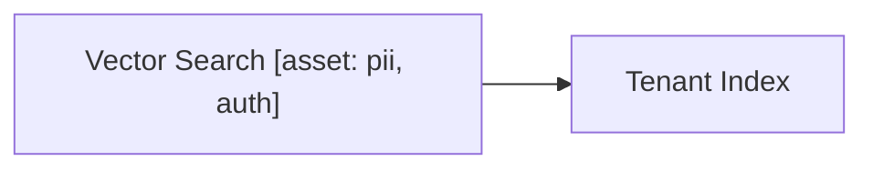

# Threat Model: Multi-tenant Vector Search

Deterministic transformation fixture. This is not a live-agent evaluation.
Upstream verification in https://github.com/davidmatousek/tachi/issues/356 failed.



### Components

| Component | Type | Description |
| --- | --- | --- |
| Vector Search | Process | Executes LLM-synthesized filters against a shared tenant index |

## 7. Recommended Actions

| Finding ID | Component | Threat | Likelihood | Impact | Risk Level | Mitigation |
| --- | --- | --- | --- | --- | --- | --- |
| OI-1 | Vector Search | Model-generated vector filter overrides tenant boundary | HIGH | HIGH | Critical | Bind tenant namespace from authenticated identity; reject model-supplied tenant predicates (CWE-943, OWASP LLM10:2026, OWASP LLM09:2026) |
| LLM-1 | Vector Search | Retrieved document injects instructions | HIGH | MEDIUM | High | Isolate untrusted retrieval content from instructions (OWASP LLM01:2026) |

## 9. Source Attribution

```yaml
OI-1:
  - {taxonomy: owasp, id: LLM09, relationship: primary}
  - {taxonomy: owasp, id: LLM10, relationship: related}
  - {taxonomy: cwe, id: CWE-943, relationship: related}
LLM-1:
  - {taxonomy: owasp, id: LLM01, relationship: primary}
  - {taxonomy: cwe, id: CWE-20, relationship: related}
```
